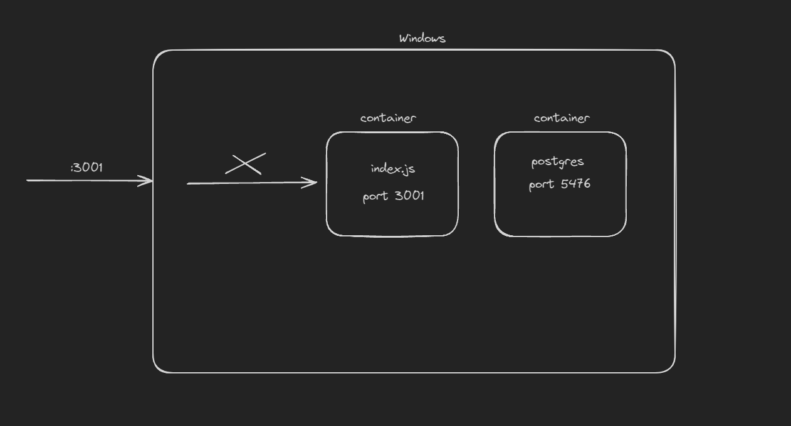

# DOCKER

Docker let's you containerise your application.

## Container

You can think container as tiny VM.

- It has its own file system.
- It has its network.
- It has it own set of ports.
- Its has separate os from your os.
- ( Think of it like dual booting. And running container on separate os i.e. VM )

If you run a program inside a container then your main os doesn't care about it. The program runs separate from our os.


Note: Container port =! your machine port. You have to map the container port to your machine port. In order to access
the application running inside container.

example: If your mapping your container port to the machine port. You're essential saying that if any request comes to
the port 4000 on my machine forward it to the container 5949 port number.

## Image

When you build a dockerized application you get an image that can be run. And an image in running is called container.
Image contain every dependency that the application need to run.


## Common Docker Commands

### Docker Run

```
docker run <imageName>
```

- To run the image on your machine.
- eg => docker run mongo
- It will start the container, but you have added the port mapping.

```
docker run -p 37015:27017 <imageName>
```

- You're machine 37015 port will be mapped to the container 27017 port number.
- So every request you will receive on 37015 port on your machine will be forwarded to the container 27017 port.